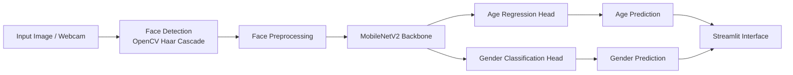
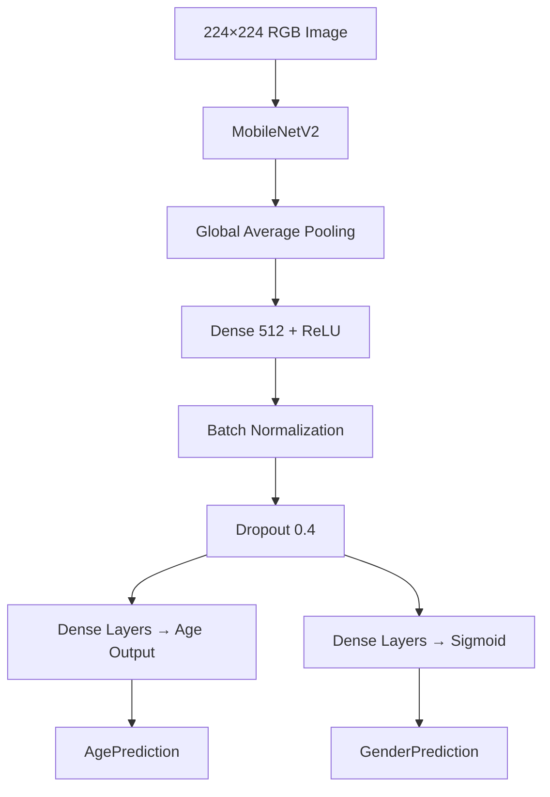

# 🤖 CyberVision AI
### AI-Powered Age & Gender Detection using Deep Learning

<p align="center">


</p>

---

## 📌 Overview

CyberVision AI is an end-to-end Deep Learning application capable of predicting a person's **Age** and **Gender** from facial images.

The project consists of two major components:

- 🧠 A multi-output Deep Learning model trained using **TensorFlow/Keras**
- 🌐 A modern **Streamlit** web application supporting:
  - Live webcam detection
  - Webcam image capture
  - Image upload prediction

The application automatically detects faces, extracts facial regions, and predicts both age and gender in real time.

---

# ✨ Features

- 🎥 Real-time webcam prediction
- 📸 Capture image from webcam
- 🖼 Upload image prediction
- 👤 Automatic face detection
- 🧠 Multi-task Deep Learning model
- ⚡ MobileNetV2 Transfer Learning
- 🎨 Modern futuristic Streamlit UI
- 🚀 Fast inference using TensorFlow

---

# 🏗 System Architecture



---

# 🧠 Model Architecture



---

# 📊 Training Pipeline


---

# 📂 Project Structure

```
CyberVision-AI
│
├── app.py
├── best_model.keras
├── haarcascade_frontalface_default.xml
├── requirements.txt
├── README.md
│
├── notebook
   └── Copy_of_Notebook_gdesh.ipynb

```

---

# ⚙ Tech Stack

| Category | Technologies |
|----------|--------------|
| Language | Python |
| Deep Learning | TensorFlow, Keras |
| Transfer Learning | MobileNetV2 |
| Computer Vision | OpenCV |
| UI | Streamlit |
| Webcam Streaming | streamlit-webrtc |
| Image Processing | Pillow, NumPy |
| Visualization | Matplotlib, Seaborn |
| Dataset | UTKFace |

---

# 📚 Dataset

The model was trained on the **UTKFace Dataset**, which contains facial images spanning a wide range of ages and genders.

### Dataset preprocessing included

- Removing invalid samples
- Age filtering
- Dataset balancing through downsampling
- Train / Validation / Test split
- Image normalization
- Data augmentation

---

# 🏋 Model Training

The network is built using **Transfer Learning**.

### Backbone

- MobileNetV2 (ImageNet pretrained)

### Multi-task Outputs

**Age Prediction**
- Regression

**Gender Prediction**
- Binary Classification

### Loss Functions

| Output | Loss |
|---------|------|
| Age | Mean Absolute Error (MAE) |
| Gender | Binary Crossentropy |

### Optimization

- Adam Optimizer
- Early Stopping
- ReduceLROnPlateau
- Fine-tuning of upper MobileNetV2 layers

---

# 🚀 Application Workflow

```text
Image/Webcam
      │
      ▼
Face Detection
      │
      ▼
Crop Face
      │
      ▼
Resize (224×224)
      │
      ▼
Normalize
      │
      ▼
Deep Learning Model
      │
      ├────────► Age Prediction
      │
      └────────► Gender Prediction
      │
      ▼
Display Results
```

---

# 📷 Detection Modes

### 🎥 Live Webcam

Real-time AI predictions using webcam streaming.

---

### 📸 Webcam Capture

Capture a single image and perform inference.

---

### 🖼 Image Upload

Upload an image and obtain predictions instantly.

---

# 💻 Installation

Clone the repository

```bash
git clone https://github.com/yourusername/CyberVision-AI.git
```

Move into the project

```bash
cd CyberVision-AI
```

Install dependencies

```bash
pip install -r requirements.txt
```

Run Streamlit

```bash
streamlit run app.py
```

---

# 📦 Required Files

Ensure the following files are placed in the project directory:

```
best_model.keras

haarcascade_frontalface_default.xml

app.py
```

---

# 📈 Future Improvements

- Face tracking
- Multiple face recognition
- Emotion detection
- Ethnicity prediction
- ONNX / TensorFlow Lite deployment
- Docker support
- GPU inference optimization
- Mobile application deployment

---

